# Development Log / Research Journal

This document tracks the development journey, experiments, challenges, and decisions made during the development of the Chart OCR Processor.

## Executive Summary

### Final Solution
- **OCR Engine**: Google Cloud Vision API (one-stage approach)
- **Text Detection**: 149 regions detected per image (vs 125 with CRAFT+EasyOCR)
- **Matching Algorithm**: Coordinate-based spatial matching with Q-pattern normalization
- **Bar Classification**: Three-method ensemble (Adaptive Threshold, Morphology Closing, OTSU Inverted) with 100% agreement
- **Confidence Scoring**: Weighted average (0.5 × bar classification + 0.5 × previous week consistency)

### Key Decisions
1. ✅ **Google Cloud Vision API** selected over local OCR solutions (Tesseract, EasyOCR, CRAFT)
2. ✅ **One-stage approach** (detection + recognition in single API call) over two-stage (CRAFT + OCR)
3. ✅ **Coordinate-based matching** for quarter-value pairing using spatial relationships
4. ✅ **Multi-method ensemble** for bar graph classification (3 methods with voting)
5. ✅ **Composite confidence score** combining internal reliability and external consistency

### Abandoned Approaches
- ❌ OpenAI Vision API: Poor performance
- ❌ Gemini Vision Model: Rate limiting issues
- ❌ Tesseract OCR: Poor text detection accuracy
- ❌ CRAFT + EasyOCR: Outperformed by Google Vision API

---

## Development Timeline

### Phase Summary

| Phase | Approach | Status | Result |
|-------|----------|--------|--------|
| **Phase 1** | Cloud Vision APIs (OpenAI, Gemini) | ❌ Abandoned | Rate limiting, poor performance |
| **Phase 2** | Tesseract OCR | ❌ Abandoned | Poor text detection (141 regions) |
| **Phase 3** | CRAFT + EasyOCR | ⚠️ Research | Better detection (125 regions) but outperformed |
| **Phase 4** | Google Cloud Vision API | ✅ **Final** | Best performance (149 regions) |
| **Phase 5** | Coordinate-based Matching | ✅ Implemented | 16 quarter-value pairs matched |
| **Phase 6** | Image Preprocessing Research | ✅ Research | 14 techniques tested, 3 selected |
| **Phase 7** | Multi-Method Bar Classification | ✅ Implemented | 100% agreement (3/3 methods) |
| **Phase 8** | Confidence Score Calculation | ✅ Implemented | Weighted composite score |

---

## Phase 1: Cloud-based Vision API Experiments

<details>
<summary><strong>Summary</strong>: Tested OpenAI and Gemini Vision APIs. Both abandoned due to rate limiting and performance issues.</summary>

### Attempt 1: OpenAI Vision API
- **Date**: Initial exploration
- **Approach**: Used OpenAI's vision model for text extraction from chart images
- **Results**: 
  - Performance was unsatisfactory
  - The model struggled to accurately identify and extract quarter labels (Q1'14, Q2'15, etc.) and EPS values
  - Low accuracy in matching quarter labels with their corresponding values
- **Decision**: ❌ Abandoned due to poor performance

### Attempt 2: Gemini Vision Model
- **Date**: After OpenAI Vision API
- **Approach**: Tested Google's Gemini Vision model as an alternative
- **Results**:
  - Showed better results compared to OpenAI Vision
  - Better accuracy in text recognition
- **Challenges**:
  - Encountered significant rate limiting issues
  - Unable to process large batches of images efficiently
  - Cost and scalability concerns for processing 379+ images
- **Decision**: ❌ Abandoned due to rate limiting constraints

</details>

---

## Phase 2: Local Image Processing with Tesseract OCR

<details>
<summary><strong>Summary</strong>: Implemented local Tesseract OCR pipeline. Abandoned due to poor text detection accuracy (only 141 regions detected).</summary>

#### Implementation: Tesseract OCR Pipeline
- **Date**: After cloud API experiments
- **Approach**: Implemented local image processing solution using:
  - OpenCV for image preprocessing
  - Tesseract OCR for text extraction
  - Custom parsing logic for quarter labels and EPS values

**Image Preprocessing Pipeline**:
1. Grayscale conversion
2. Noise reduction using Non-local Means Denoising
3. Binary thresholding (Otsu's method)
4. Morphological operations for text enhancement

**Results**:
- ✅ Successfully implemented local processing pipeline
- ✅ No rate limiting issues
- ✅ Can process images in batch

**Challenges Discovered**:

1. **Poor Text Detection Accuracy**
   - Tesseract's bounding box detection was inaccurate
   - Many text regions were missed or incorrectly identified
   - Visualization shows fragmented and missing bounding boxes

   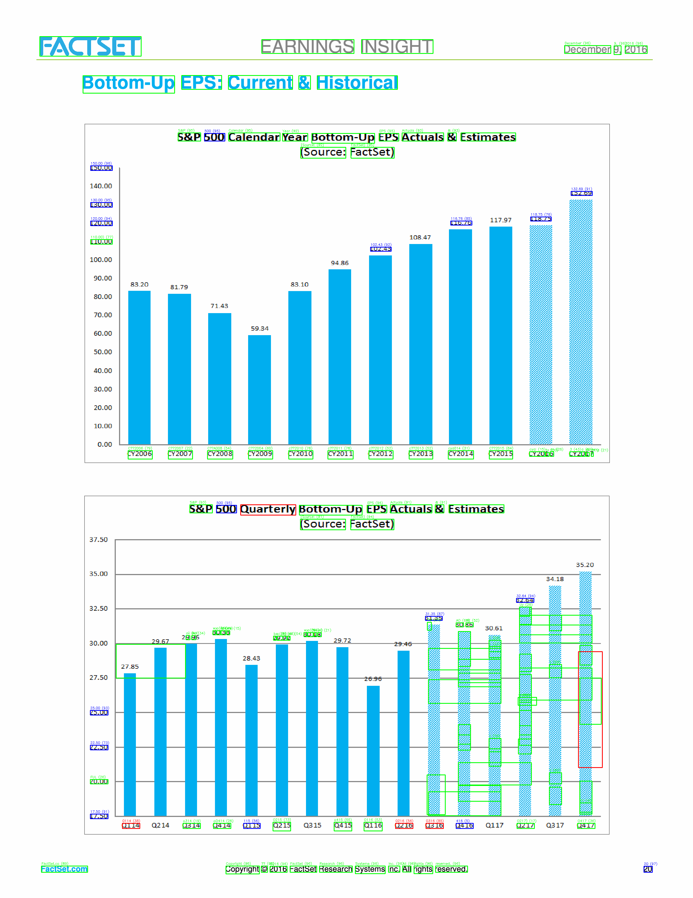

2. **Quarter Label Recognition Issues**
   - OCR often misrecognized quarter labels:
     - `Q1'14` → `Q114` or `0114`
     - `Q2'17` → `Q217` or `0217`
   - Implemented pattern matching to handle these misrecognitions
   - Still missing many quarter labels entirely

3. **Spatial Relationship Problems**
   - Difficulty in correctly matching quarter labels with their corresponding EPS values
   - Text boxes don't accurately represent spatial relationships
   - Current matching algorithm assigns same EPS value (32.64) to multiple quarters
   - Example: Q1'14 should be 27.85, but extracted as 32.64

4. **Limited Text Region Detection**
   - Only 141 text boxes detected from a complex chart image
   - Many quarter labels and values are missed
   - Box visualization shows poor coverage

**Current Status**:
- ✅ Basic OCR pipeline working
- ✅ Quarter label parsing handles common OCR misrecognitions
- ⚠️ Text detection accuracy: Poor
- ⚠️ Quarter-EPS matching: Inaccurate (all values showing as 32.64)
- ⚠️ Missing many quarter labels and values

**Test Results** (5 images processed):
- Extracted 10 records from first image (2016-12-09)
- Only Q2'17 matched correctly (32.64)
- All other quarters had incorrect EPS values
- Many quarters missing from extraction

**Decision**: ❌ Abandoned due to poor text detection accuracy

</details>

---

## Phase 3: CRAFT Text Detection Model

<details>
<summary><strong>Summary</strong>: Implemented CRAFT model for better text detection (125 regions). Compared EasyOCR vs Tesseract. Outperformed by Google Vision API.</summary>

#### Research: CRAFT Model for Text Detection
- **Date**: Current phase
- **Motivation**: Address Tesseract's poor text detection capabilities
- **Approach**: Implement CRAFT (Character Region Awareness for Text detection) model
  - Deep learning-based text detection
  - Superior text region segmentation
  - Better handling of complex layouts (charts, tables)

**Why CRAFT?**
- More accurate text region detection compared to Tesseract
- Better handling of text in complex layouts (like charts)
- Improved ability to detect text at various scales and orientations
- Better separation of text regions before OCR recognition
- Can provide precise bounding boxes for text regions

#### Implementation: CRAFT Model Integration

**Model Setup**:
- Used pre-trained CRAFT model (`craft_mlt_25k.pth`)
- Integrated PyTorch-based CRAFT detector
- Model outputs two score maps:
  - **Region Score Map**: Character-level text region confidence
  - **Affinity Score Map**: Character connection confidence

**CRAFT Score Maps Visualization**:

The CRAFT model generates two important score maps that help understand text detection:

1. **Region Score Map**: Shows character-level text region confidence
   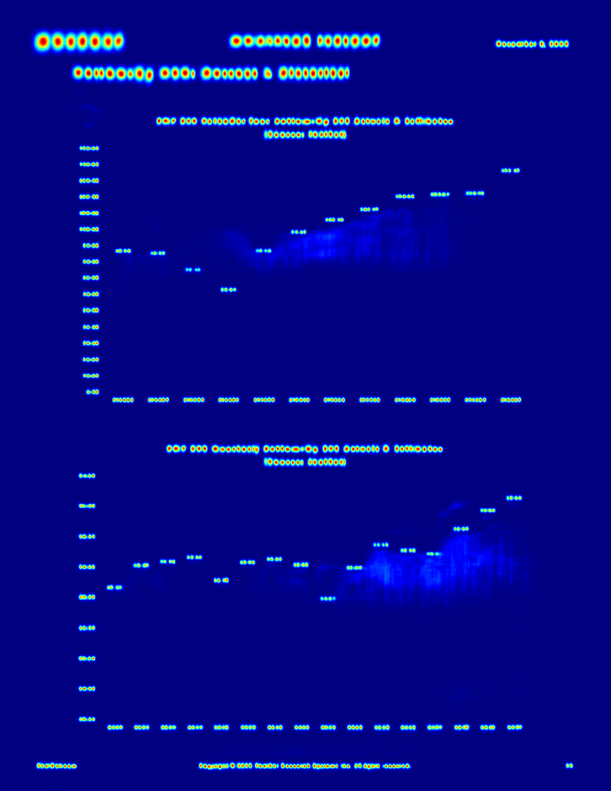

2. **Affinity Score Map**: Shows character connection confidence
   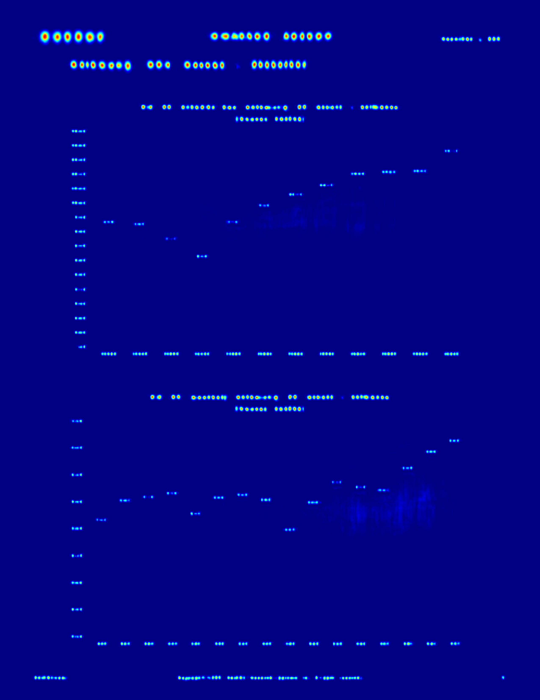

**Threshold Tuning**:

Different threshold combinations were tested to optimize text detection:

- **Threshold 0.2, 0.2** (text_threshold=0.2, link_threshold=0.2):
  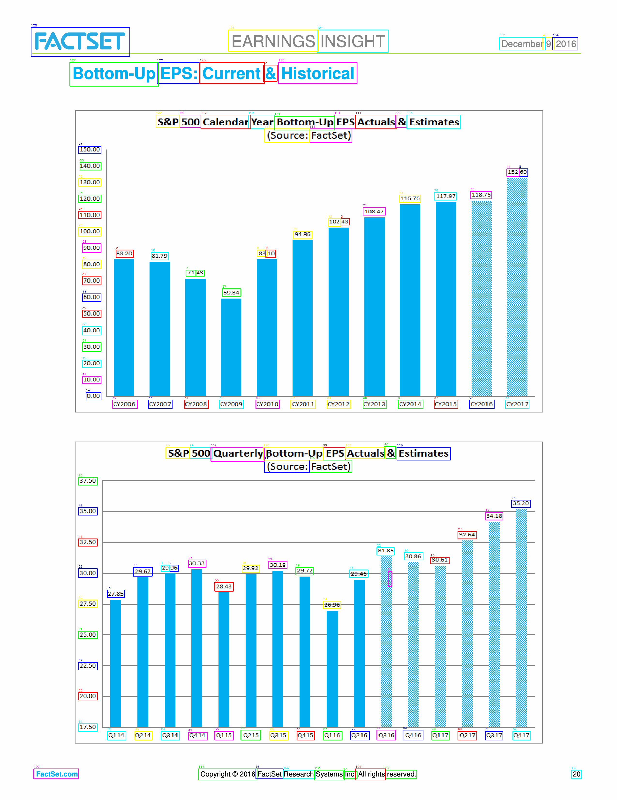

- **Threshold 0.25, 0.25** (text_threshold=0.25, link_threshold=0.25):
  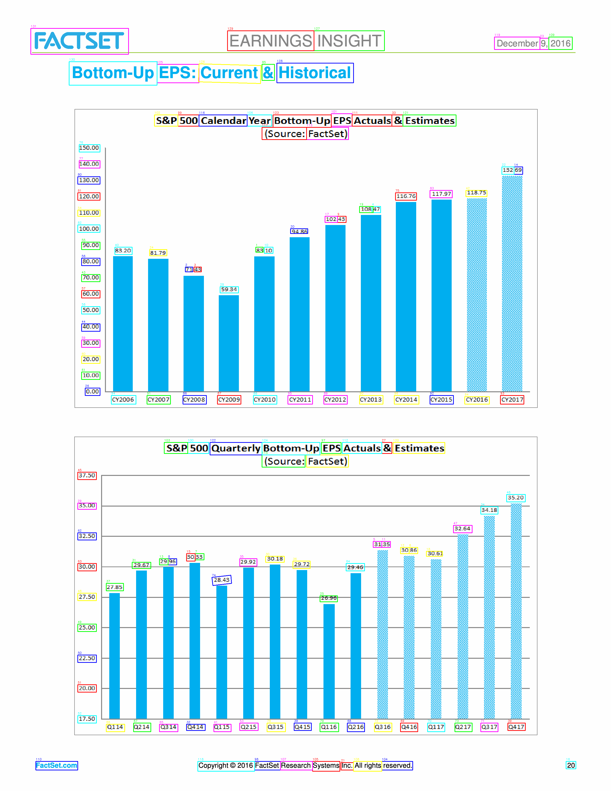

- **Threshold 0.3, 0.3** (text_threshold=0.3, link_threshold=0.3):
  

**Threshold Tuning Results**:

After extensive testing, the optimal configuration was determined:

- **text_threshold=0.3**: Region score threshold (character detection)
- **link_threshold=0.15**: Affinity score threshold (character connection) - lowered to allow more character connections
- **low_text=0.2**: Initial binarization threshold for connected component detection
- **Result**: 125 text regions detected (optimal balance between detection coverage and accuracy)

#### OCR Engine Comparison: EasyOCR vs Tesseract

After implementing CRAFT for text detection, we compared two OCR engines for text recognition:

**Final Configuration**:
- CRAFT detection: text_threshold=0.3, link_threshold=0.15, low_text=0.2
- No whitelist filtering (all characters recognized)
- Both engines process the same 125 detected text regions
- EasyOCR selected as the final OCR engine

**EasyOCR Results** (125 valid OCR results with optimal threshold settings):
- Excellent accuracy for decimal numbers: `30.61`, `81.79`, `34.18`, `27.85`, `83.20`, `37.50`, `35.20`, `31.64`, `30.86`, `30.18`
- Correctly identifies all numeric values including decimals
- Better handling of large numbers: `2992`, `2972`, `3135`, `3033`, `696`
- Recognizes text labels: `Inc:`, `&` (when whitelist is removed)
- **Selected as the final OCR engine** for production use


**Tesseract Results** (114 valid OCR results):
- Some decimal recognition issues: `8179` instead of `81.79`
- More false positives: single characters like `a`, `.`
- Inconsistent decimal point handling: `35.000` vs `35.00`
- Still struggles with some number patterns

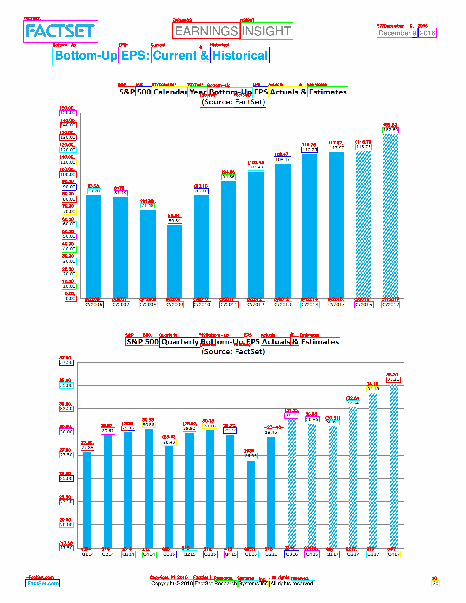

**Decision**: ⚠️ Research phase - Outperformed by Google Cloud Vision API in Phase 4

</details>

---

## Phase 4: Google Cloud Vision API (Final Solution)

<details>
<summary><strong>Summary</strong>: ✅ <strong>FINAL SOLUTION</strong> - Google Cloud Vision API selected for production. 149 regions detected per image, single API call for detection + recognition.</summary>

#### Implementation: Google Cloud Vision API
- **Date**: Final phase
- **Approach**: Use Google Cloud Vision API for both text detection and recognition
- **Advantage**: Google Vision API performs both detection and recognition in a single call, eliminating the need for separate detection models

**Why Google Cloud Vision API?**
- Built-in text detection and recognition in one API call
- Superior accuracy compared to local OCR solutions
- Handles complex layouts (charts, tables) excellently
- No need for separate detection models (CRAFT) or preprocessing
- Professional-grade OCR performance

**Results**:
- **149 text regions detected and recognized** from a single chart image
- Excellent accuracy for all numeric values:
  - Large numbers: `150.00`, `140.00`, `130.00`, `120.00`, `110.00`, `100.00`
  - Decimal values: `83.20`, `81.79`, `71.43`, `59.34`, `83.10`
  - Complex numbers: `117.97`, `118.75`, `116.76`, `108.47`, `102.43`, `94.86`, `132.69`
  - Small decimals: `37.50`, `35.00`, `32.50`, `30.00`, `27.85`, `27.50`, `25.00`, `22.50`, `20.00`
- Recognizes all text labels: `FACTSET`, `EARNINGS INSIGHT`, `Bottom-Up EPS`, `S&P 500`, etc.
- **Selected as the final production solution**

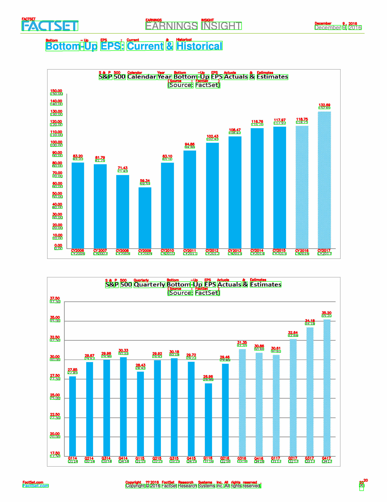

**Key Findings**:
1. **Google Cloud Vision API outperforms all local solutions**: 149 regions detected vs 125 with CRAFT+EasyOCR
2. **Single API call for detection and recognition**: No need for separate detection models
3. **Superior accuracy**: Perfect decimal recognition, no misrecognitions
4. **Production-ready**: Professional-grade OCR suitable for production use

**Decision**: ✅ **FINAL SOLUTION** - Selected for production

</details>

---

## Phase 5: Coordinate-Based Quarter-Value Matching Algorithm

<details>
<summary><strong>Summary</strong>: Implemented spatial relationship matching algorithm. 16 quarter-value pairs successfully matched using coordinate-based approach.</summary>

#### Implementation: Spatial Relationship Matching
- **Date**: After Google Cloud Vision API integration
- **Approach**: Use coordinate information from OCR results to match quarter labels with their corresponding EPS values
- **Challenge**: OCR provides text and coordinates, but doesn't automatically match quarters with values

**Algorithm Overview**:

1. **Q Pattern Extraction and Normalization**:
   - Extract Q patterns from bottom 30% of image (where quarter labels are located)
   - Normalize OCR misrecognitions:
     - `Q` → `O`, `0` (when Q is recognized as O or 0)
     - `1` → `I`, `l` (when 1 is recognized as I or l)
   - Pattern matching for: `Q1'17`, `Q114`, `0114`, `Q1i7y` etc.
   - Sort Q boxes by x-coordinate (left to right) for chronological order

2. **Spatial Matching Algorithm**:
   - For each Q box, find the nearest number in the same y-range
   - **Constraints**:
     - x_tolerance: 10 pixels (Q box and number must be vertically aligned)
     - y_tolerance: 1000 pixels (number can be above Q box, but not too far)
     - Number must be above Q box (y coordinate smaller)
     - Exclude Q patterns from number candidates
     - Exclude large numbers (>= 2000, likely years)

3. **Distance Calculation**:
   - Calculate Euclidean distance between Q box center and number box center
   - Weight x-difference more heavily (10x) than y-difference (0.1x)
   - Select the number with minimum distance

**Results**:
- **16 quarter-value pairs successfully matched** from test image
- All matches are spatially correct (Q box and EPS value are vertically aligned)
- Chronological order maintained (sorted by x-coordinate)

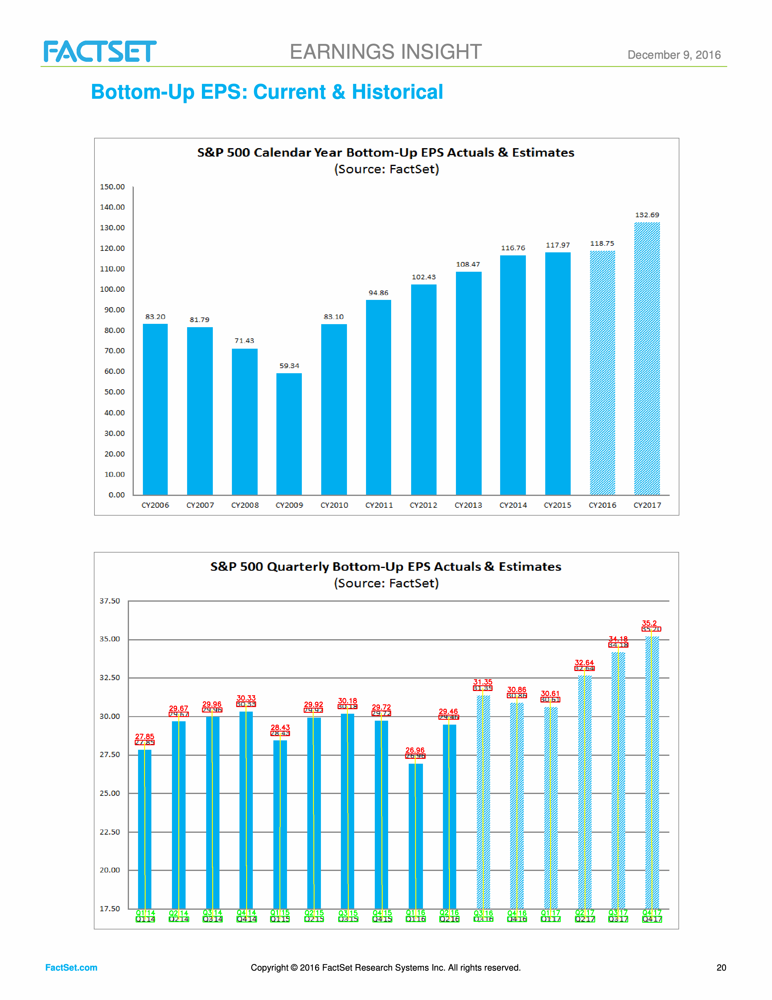

**Example Matches**:
- Q1'14: 27.85 (x_diff: 3px, y_diff: 582px)
- Q2'14: 29.67 (x_diff: 0px, y_diff: 676px)
- Q3'14: 29.96 (x_diff: 2px, y_diff: 688px)
- Q4'14: 30.33 (x_diff: 1px, y_diff: 708px)
- ... (all 16 quarters matched correctly)

**Key Parameters**:
- `bottom_percent = 0.3`: Bottom 30% of image for Q pattern detection
- `x_tolerance = 10.0`: Maximum x-coordinate difference (pixels)
- `y_tolerance = 1000.0`: Maximum y-coordinate difference (pixels)
- `brightness_threshold = 150.0`: For bar color classification (dark vs light)

**Decision**: ✅ Implemented and working

</details>

---

## Phase 6: Image Preprocessing for Bar Graph Classification

<details>
<summary><strong>Summary</strong>: Tested 14 preprocessing techniques. Selected 3 methods for ensemble classification: Adaptive Threshold, Morphology Closing, OTSU Binary Inverted.</summary>

#### Research: Image Preprocessing Techniques
- **Date**: After coordinate-based matching implementation
- **Approach**: Test various image preprocessing techniques to optimize bar graph classification
- **Challenge**: Different bar graph types (filled vs partially filled) require different preprocessing approaches

**Preprocessing Techniques Tested**:

We tested 14 different preprocessing techniques on the chart images. Results shown below in a 3×5 grid for easy comparison:

<table>
<tr>
<td><strong>1. Original</strong><br></td>
<td><strong>2. Grayscale</strong><br></td>
<td><strong>3. OTSU Binary</strong><br></td>
</tr>
<tr>
<td><strong>4. OTSU Binary Inverted</strong><br>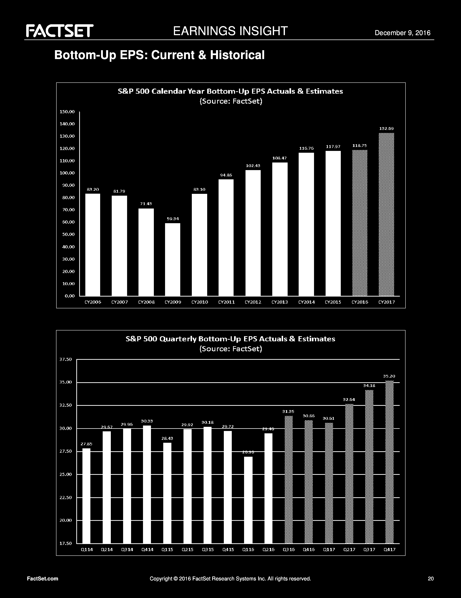</td>
<td><strong>5. Adaptive Threshold</strong><br>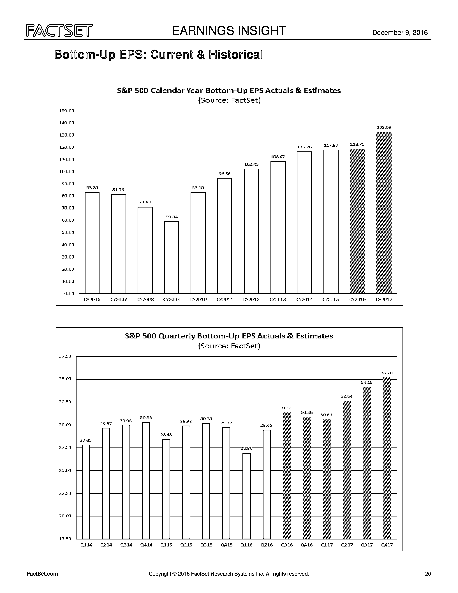</td>
<td><strong>6. CLAHE</strong><br></td>
</tr>
<tr>
<td><strong>7. Histogram Equalization</strong><br></td>
<td><strong>8. Gaussian Blur</strong><br>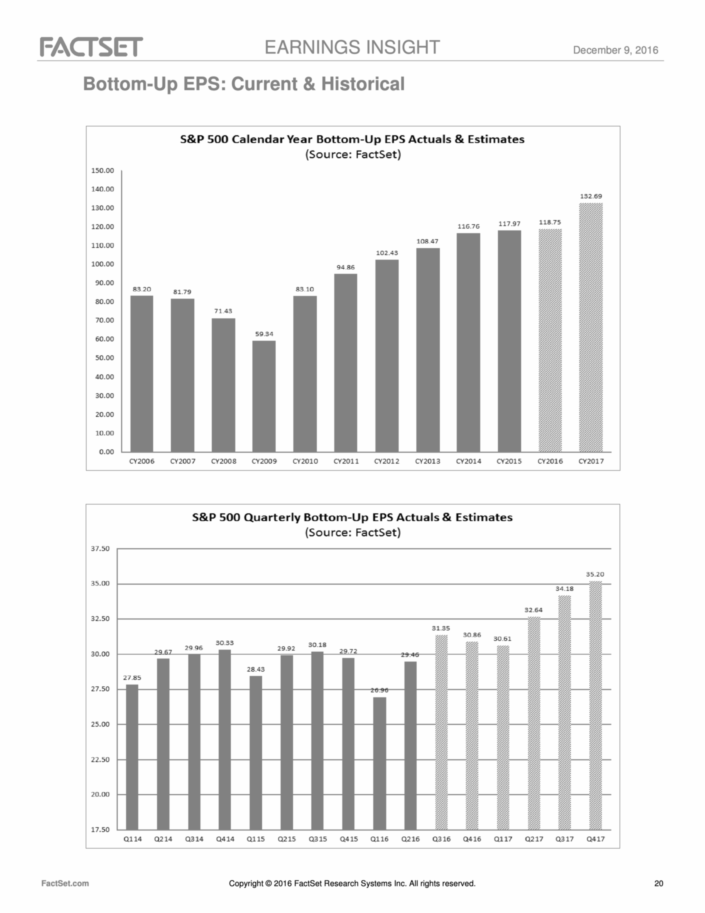</td>
<td><strong>9. Denoised</strong><br></td>
</tr>
<tr>
<td><strong>10. Morphology Closing</strong><br>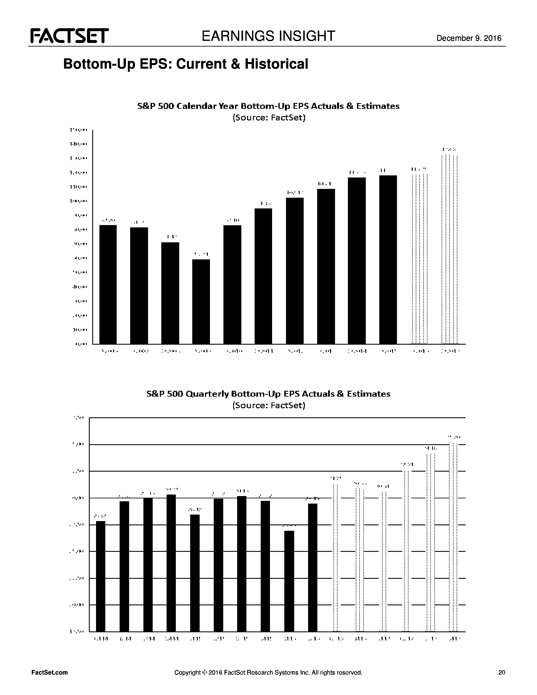</td>
<td><strong>11. Morphology Opening</strong><br>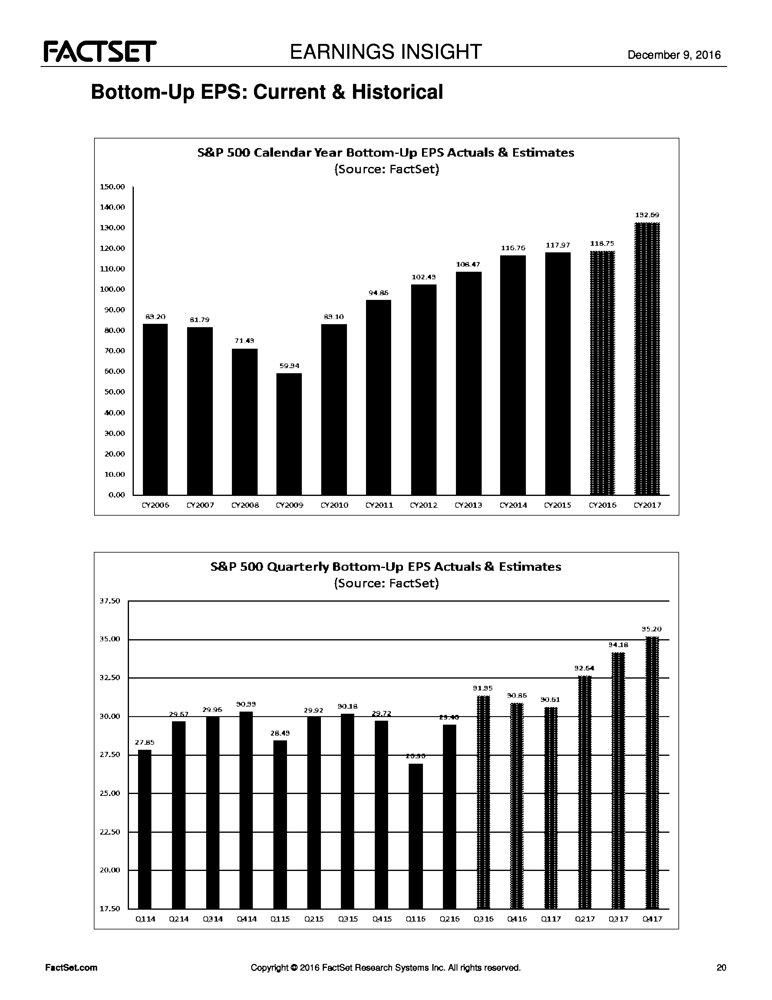</td>
<td><strong>12. CLAHE + OTSU</strong><br>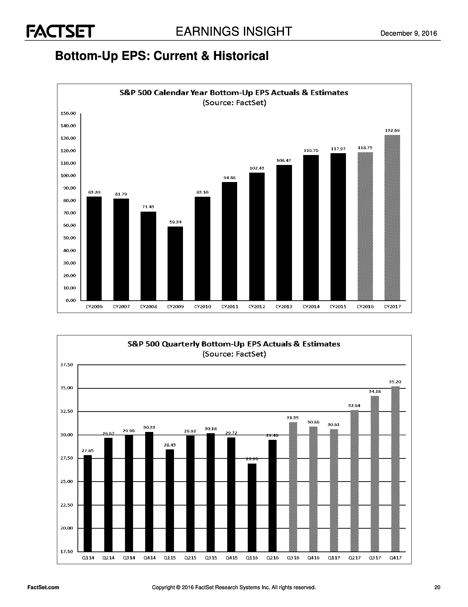</td>
</tr>
<tr>
<td><strong>13. Denoised + OTSU</strong><br></td>
<td><strong>14. Histogram Equalization + OTSU</strong><br>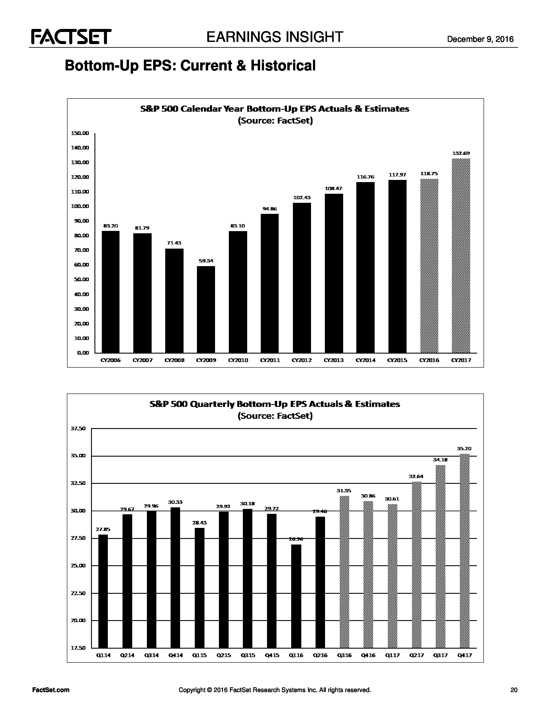</td>
<td></td>
</tr>
</table>

**Selected Preprocessing Methods**:

After extensive testing, we selected **three methods** for ensemble classification (see Phase 7):

1. **Adaptive Threshold**:
   - Creates sharp boundaries between bars and background
   - Optimal for fully filled bar graphs with clear contours
   - Threshold: 0.7 (white pixel ratio > 0.7 = dark bar)

2. **Morphology Closing**:
   - Fills gaps and holes in partially filled bars
   - Optimal for partially filled bar graphs
   - **Important**: Uses inverted logic (low ratio = dark, high ratio = light)
   - Threshold: 0.5 (white pixel ratio > 0.5 = light bar, ≤ 0.5 = dark bar)

3. **OTSU Binary Inverted**:
   - Inverted binary image (dark regions become white)
   - Helps identify dark bars more clearly
   - Threshold: 0.7 (white pixel ratio > 0.7 = dark bar)

**Decision**: ✅ Three methods selected for ensemble classification

</details>

---

## Phase 7: Multi-Method Bar Graph Classification with Confidence Scoring

<details>
<summary><strong>Summary</strong>: Implemented three-method ensemble classification. Achieved 100% agreement (3/3 methods) on test images.</summary>

#### Implementation: Three-Method Ensemble Classification
- **Date**: After image preprocessing research
- **Approach**: Use three preprocessing methods simultaneously and apply voting mechanism with confidence scoring
- **Challenge**: Single method may misclassify certain bar graph types; need robust ensemble approach

**Selected Methods**:

After analyzing the preprocessing results, we selected **three methods** for ensemble classification:

1. **Adaptive Threshold**:
   - Creates sharp boundaries between bars and background
   - Optimal for fully filled bar graphs with clear contours
   - Threshold: 0.7 (white pixel ratio > 0.7 = dark bar)

2. **Morphology Closing**:
   - Fills gaps and holes in partially filled bars
   - Optimal for partially filled bar graphs
   - **Important**: Uses inverted logic (low ratio = dark, high ratio = light)
   - Threshold: 0.5 (white pixel ratio > 0.5 = light bar, ≤ 0.5 = dark bar)
   - **Rationale**: Morphology closing fills holes, so:
     - Low white ratio (0.05-0.1) = partially filled = **dark**
     - High white ratio (0.9-0.95) = fully filled = **light**

3. **OTSU Binary Inverted**:
   - Inverted binary image (dark regions become white)
   - Helps identify dark bars more clearly
   - Threshold: 0.7 (white pixel ratio > 0.7 = dark bar)

**Algorithm**:

1. **Preprocessing** (performed once per image):
   - Convert to grayscale
   - Generate three preprocessed images:
     - Adaptive Threshold (Gaussian, block size 11)
     - Morphology Closing (OTSU binary + closing operation)
     - OTSU Binary Inverted

2. **Bar Region Extraction**:
   - For each matched Q-number pair:
     - Crop bar region between Q box and number box
     - Extract region from all three preprocessed images

3. **Classification**:
   - Calculate white pixel ratio for each cropped region
   - Apply method-specific threshold and logic
   - Each method votes: 'dark' or 'light'

4. **Voting and Confidence**:
   - **High confidence (3/3)**: All three methods agree
   - **Medium confidence (2/3)**: Two methods agree
   - **Low confidence (1/3 or 0/3)**: Methods disagree
   - Final classification: Majority vote

**Threshold Tuning Process**:

Initial thresholds were too low (0.3-0.4), causing all bars to be classified as 'dark'. After analyzing the distribution:

- **Adaptive Threshold**: min=0.518, max=0.987, median=0.982 → Threshold: **0.7**
- **Morphology Closing**: min=0.052, max=0.947, median=0.065 → Threshold: **0.5** (with inverted logic)
- **OTSU Inverted**: min=0.475, max=0.948, median=0.935 → Threshold: **0.7**

**Critical Fix: Morphology Closing Logic**:

Initially, Morphology Closing used the same logic as other methods (`white_ratio > threshold = dark`), but this was incorrect. Since closing fills holes:
- **Low white ratio (0.05-0.07)**: Partially filled bars → **dark**
- **High white ratio (0.9-0.95)**: Fully filled bars → **light**

The logic was corrected to: `white_ratio > threshold = light` (inverted).

**Results**:

After fixing the Morphology Closing logic, all three methods achieve **100% agreement**:

- **Test Image 1 (20161209-6.png)**:
  - Dark bars: 10
  - Light bars: 6
  - High confidence (3/3): 16 (100%)
  - Medium confidence: 0
  - Low confidence: 0


- **Test Image 2 (20161216-6.png)**:
  - Dark bars: 10
  - Light bars: 6
  - High confidence (3/3): 16 (100%)
  - Medium confidence: 0
  - Low confidence: 0

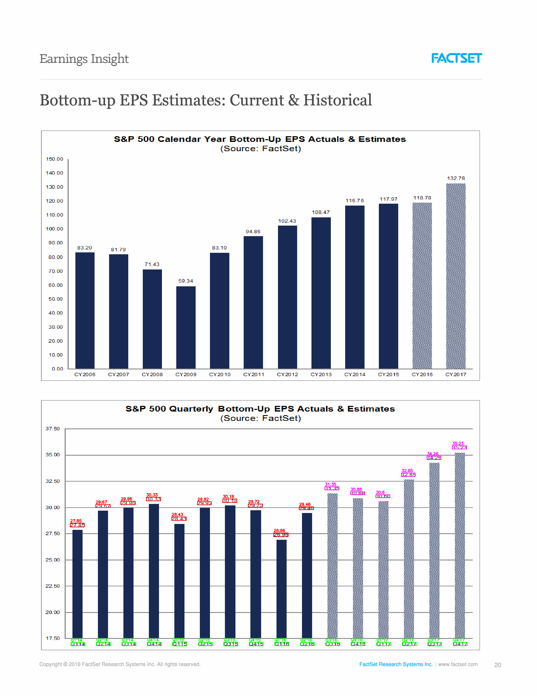

**Key Findings**:

1. **Ensemble approach is essential**: Single method may misclassify, but three methods together provide robust classification
2. **Method-specific logic matters**: Morphology Closing requires inverted logic due to its hole-filling nature
3. **Threshold tuning is critical**: Initial thresholds (0.3-0.4) were too low; optimal thresholds (0.5-0.7) were found through distribution analysis
4. **Perfect agreement is achievable**: With proper thresholds and logic, all three methods can achieve 100% agreement
5. **Visualization helps validation**: Color-coded bounding boxes (red for dark, magenta for light) make it easy to verify classification accuracy

**Decision**: ✅ Implemented with 100% agreement

</details>

---

## Phase 8: Confidence Score Calculation with Weighted Components

<details>
<summary><strong>Summary</strong>: Implemented composite confidence score combining bar classification confidence (0.5 weight) and previous week consistency (0.5 weight).</summary>

#### Implementation: Composite Confidence Scoring
- **Date**: After multi-method bar graph classification
- **Approach**: Calculate final confidence score by combining bar graph classification confidence with consistency check against previous week's data
- **Challenge**: Need to balance internal classification reliability with external data consistency

**Confidence Score Components**:

The final confidence score is calculated as a **weighted average** of two components:

1. **Bar Graph Classification Confidence** (Weight: 0.5):
   - Based on agreement among three classification methods
   - **High (3/3 match)**: 100% confidence
   - **Medium (2/3 match)**: 67% confidence
   - **Low (1/3 or 0/3 match)**: 33% confidence
   - Average across all matched quarter-value pairs for the report date

2. **Previous Week Data Consistency** (Weight: 0.5):
   - Compares current week's **actual values** (dark bars) with closest previous week's actual values
   - Only compares actual values (excludes estimates marked with `*`)
   - **80% match threshold**: Values within 20% difference are considered consistent
   - Consistency rate = (matching quarters / total comparable quarters) × 100
   - **Special case**: First data entry uses 100% consistency (no previous data to compare)

**Final Confidence Calculation**:

```
Final Confidence = (Bar Score × 0.5) + (Consistency Score × 0.5)
```

**Example**:
- Bar graph classification: 3/3 match for all quarters → Bar Score = 100%
- Previous week consistency: 12 out of 15 quarters match → Consistency Score = 80%
- Final Confidence = (100 × 0.5) + (80 × 0.5) = **90.0%**

**Key Design Decisions**:

1. **Equal weights (0.5, 0.5)**: Both components are equally important
   - Internal classification reliability (bar graph methods agreement)
   - External data consistency (alignment with historical data)

2. **Actual values only for consistency check**: 
   - Only compares actual values (dark bars) between weeks
   - Estimates (light bars) are excluded from consistency calculation
   - Rationale: Estimates can vary significantly, but actuals should be stable

3. **Closest previous date** (not strictly 7 days):
   - Finds the closest previous date with data available
   - Handles missing weeks gracefully
   - More robust than strict 7-day interval

4. **First data entry exception**:
   - First report date uses 100% consistency score
   - No previous data available for comparison
   - Relies solely on bar graph classification confidence

**Results**:

The confidence score provides a reliable indicator of data quality:
- **High confidence (80-100%)**: Both classification and consistency are strong
- **Medium confidence (50-80%)**: One component is weaker
- **Low confidence (<50%)**: Both components indicate potential issues

This weighted approach ensures that the final confidence score reflects both the internal reliability of the classification process and the external consistency with historical data patterns.

**Decision**: ✅ Implemented

</details>

---

## Key Learnings

### 1. OCR Engine Selection
- **Google Cloud Vision API** outperforms all local solutions (149 regions vs 125 with CRAFT+EasyOCR)
- **One-stage approach** (detection + recognition) is simpler and more accurate than two-stage
- Professional-grade cloud solutions outperform local OCR engines for production use

### 2. Text Detection is Critical
- Poor detection leads to poor overall results (Tesseract: 141 regions)
- Better detection enables better recognition (CRAFT: 125 regions, Google Vision: 149 regions)
- Preprocessing helps but doesn't solve fundamental detection issues

### 3. Spatial Relationships Matter
- Coordinate-based matching is essential for matching quarter labels with values
- x-coordinate alignment is more important than y-coordinate (x_tolerance: 10px vs y_tolerance: 1000px)
- Q pattern normalization handles OCR misrecognitions effectively

### 4. Ensemble Classification Works
- Multi-method ensemble (3 methods) provides robust classification
- Method-specific logic is crucial (e.g., Morphology Closing requires inverted logic)
- Threshold tuning through distribution analysis is essential
- Perfect agreement (100% 3/3 match) is achievable with proper tuning

### 5. Confidence Scoring Strategy
- Composite score combining internal reliability and external consistency
- Equal weights (0.5, 0.5) balance both components effectively
- Only actual values used for consistency comparison (estimates excluded)
- Closest previous date approach handles missing weeks gracefully

---

## References

### OCR and Text Detection
- **Google Cloud Vision API**: [Official Documentation](https://cloud.google.com/vision/docs) - Final production solution for text detection and recognition
- **CRAFT Model**: [Character Region Awareness for Text Detection](https://github.com/clovaai/CRAFT-pytorch) - Deep learning-based text detection model (used in research phase)
- **EasyOCR**: [EasyOCR GitHub](https://github.com/JaidedAI/EasyOCR) - OCR engine tested for text recognition (used in comparison experiments)
- **Tesseract OCR**: https://github.com/tesseract-ocr/tesseract - Open-source OCR engine (used in initial experiments)

### Image Processing
- **OpenCV**: [OpenCV Documentation](https://docs.opencv.org/) - Image preprocessing and computer vision operations

### PDF Processing
- **pdfplumber**: [pdfplumber Documentation](https://github.com/jsvine/pdfplumber) - PDF parsing and page-to-image conversion for extracting chart pages from FactSet PDFs
