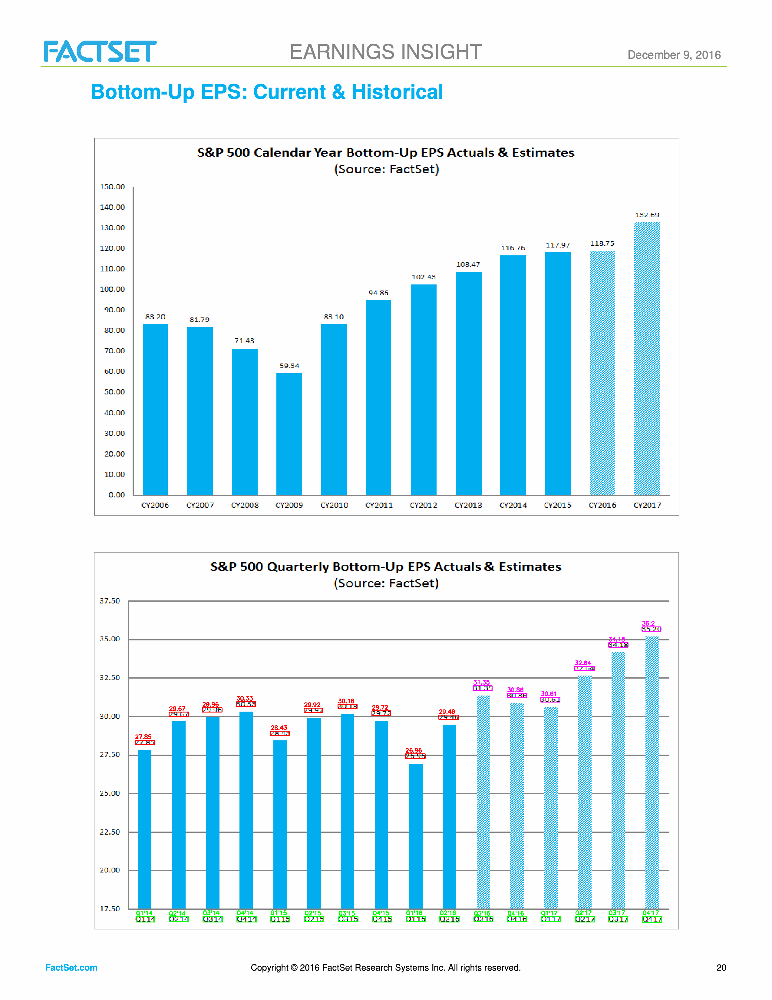

# Chart OCR Processor

A Python application for extracting quarterly EPS (Earnings Per Share) estimates from chart images using OCR and image processing techniques.

## Overview

This project processes chart images containing S&P 500 quarterly EPS data and extracts quarter labels (e.g., Q1'14, Q2'15) and corresponding EPS values. The extracted data is saved in CSV format for further analysis.

### Motivation

Financial data providers (FactSet, Bloomberg, Investing.com, etc.) typically offer historical EPS data as **actual values**—once a quarter's earnings are reported, the estimate is overwritten with the actual figure. This creates a challenge for backtesting predictive models: using historical data means testing against information that was already reflected in stock prices at the time, making it difficult to evaluate the true predictive power of EPS estimates.

To address this, this project extracts **point-in-time EPS estimates** from historical FactSet Earnings Insight reports. By preserving the estimates as they appeared at each report date (before actual earnings were announced), we can build a dataset that accurately reflects what was known and expected at each point in time, enabling more meaningful backtesting and predictive analysis.

## Project Structure

```
chart_ocr_processor/
├── src/
│   └── chart_ocr_processor/
│       ├── __init__.py
│       ├── bar_classifier.py      # Bar graph classification
│       ├── coordinate_matcher.py  # Coordinate-based matching
│       ├── google_vision_processor.py  # Google Cloud Vision OCR
│       ├── parser.py              # Quarter and EPS parsing logic
│       └── processor.py           # Main processing pipeline
├── scripts/
│   ├── data_collection/          # Data collection scripts
│   │   ├── download_factset_pdfs.py  # Download PDFs from FactSet
│   │   └── extract_eps_charts.py    # Extract charts from PDFs
│   ├── testing/                   # Test scripts
│   └── visualization/            # Visualization scripts
├── output/
│   ├── estimates/                 # Input PNG images
│   ├── factset_pdfs/              # Downloaded PDF files
│   └── preprocessing_test/        # Preprocessing visualization results
├── main.py                         # Main entry point
└── pyproject.toml                  # Project configuration
```

## Installation

This project uses `uv` for dependency management:

```bash
# Install uv if not already installed
curl -LsSf https://astral.sh/uv/install.sh | sh

# Install dependencies
uv sync
```

### Additional Requirements

- **Google Cloud Vision API**: Requires authentication
  - Create a service account and download JSON key file
  - Set `GOOGLE_APPLICATION_CREDENTIALS` environment variable to point to the key file
  - See [Google Cloud Vision API documentation](https://cloud.google.com/vision/docs/setup) for details

## Usage

### Data Collection

Before processing images, you need to collect the data from FactSet. The data collection process consists of two steps:

#### Step 1: Download PDFs from FactSet

The script downloads Earnings Insight PDFs from FactSet's public repository by reverse-searching from today back to 2000.

```bash
uv run python scripts/data_collection/download_factset_pdfs.py
```

**How it works**:
- Searches FactSet's public URL: `https://advantage.factset.com/hubfs/Website/Resources%20Section/Research%20Desk/Earnings%20Insight/`
- Tries multiple date formats (MMDDYY, MMDDYYYY) for each date
- Downloads PDFs in reverse chronological order (newest first)
- Saves PDFs to `output/factset_pdfs/` directory
- Creates an index file `output/factset_pdfs_index.json` with download metadata
- Includes rate limiting (0.05 seconds between requests) to be respectful

**Example output**:
```
🔍 FactSet Earnings Insight PDF reverse search and download
Period: 2025-11-17 → 2000-01-01 (reverse)
================================================================================
✅ 2025-11-17: 111725      |  523.7 KB | Download complete
✅ 2025-11-10: 111025      |  987.6 KB | Download complete
...
📊 Final Results
URLs tested: 9,500
PDFs found: 385
Total size: 1250.3 MB
```

#### Step 2: Extract EPS Chart Pages from PDFs

The script extracts the specific page containing the "Bottom-Up EPS Estimates" chart from each PDF and converts it to a high-resolution PNG image.

```bash
uv run python scripts/data_collection/extract_eps_charts.py
```

**How it works**:
- Opens each PDF file in `output/factset_pdfs/`
- Searches for pages containing keywords:
  - "Bottom-Up EPS Estimates: Current & Historical"
  - "Bottom-up EPS Estimates: Current & Historical"
  - "Bottom-Up EPS: Current & Historical"
- If keyword is found at the bottom of a page, extracts the next page (chart is typically on the following page)
- Converts the target page to PNG at 300 DPI resolution
- Saves PNG files to `output/estimates/` with naming format: `YYYYMMDD.png`

**Example output**:
```
🔍 Extracting EPS charts from FactSet PDFs
Target: 385 PDFs all
================================================================================
✅ 2016-12-09  Page  20 -> output/estimates/20161209.png
✅ 2016-12-16  Page  20 -> output/estimates/20161216.png
✅ 2016-12-23  Page  20 -> output/estimates/20161223.png
...
📊 Result: 379 files extracted
```

**Example extracted chart image**:


The extracted PNG images contain the quarterly EPS chart with:
- Quarter labels (Q1'14, Q2'14, etc.) at the bottom
- EPS values (actuals and estimates) as bar graphs
- Dark bars = Actual values
- Light bars = Estimated values (marked with `*` in output)

### Basic Usage

```bash
# Process all images in output/estimates directory
uv run python main.py

# Specify custom input/output paths
uv run python main.py --input-dir output/estimates --output output/results.csv

# Process only first 5 images (for testing)
uv run python main.py --limit 5
```

### Command Line Options

- `--input-dir`: Directory containing PNG images (default: `output/estimates`)
- `--output`: Output CSV file path (default: `output/extracted_estimates.csv`)
- `--limit`: Maximum number of images to process (for testing)

For more details on scripts, see [scripts/README.md](scripts/README.md).

## Output Format

The extracted data is saved as CSV in wide format with the following structure:

- `Report_Date`: Date extracted from filename (YYYY-MM-DD format)
- Quarter columns: `Q1'14`, `Q2'14`, `Q3'14`, etc. (sorted chronologically)
- `Confidence`: Overall confidence score (0-100%) combining bar classification confidence and consistency with previous week's data
- Estimated values are marked with `*` suffix

Example:
```csv
Report_Date,Q1'14,Q2'14,Q3'14,Q4'14,Q1'15,...,Q1'17,Q2'17,Confidence
2016-12-09,27.85,29.67,29.96,30.33,28.43,...,30.61*,32.64*,100.0
```

**Visualization of extraction result**:



The visualization shows:
- **Red bounding boxes**: Quarter labels (Q1'14, Q2'14, etc.) matched with actual EPS values (dark bars)
- **Magenta bounding boxes**: Quarter labels matched with estimated EPS values (light bars)
- All quarter-value pairs are correctly matched using coordinate-based spatial relationships

The confidence score is calculated as:
- 50% weight: Bar graph classification consistency (3/3 methods agree = 100%, 2/3 = 67%, 1/3 = 33%)
- 50% weight: Consistency with closest previous week's actual data (80% match threshold)

## Image Preprocessing Pipeline

The image preprocessing pipeline is designed to classify bar graphs as either **actual values** (dark bars) or **estimated values** (light bars). This classification is essential for correctly marking estimates with `*` in the output CSV.

### Three-Method Ensemble Classification

After testing 14 different preprocessing techniques, we selected **three methods** that work together in an ensemble approach:

1. **Adaptive Threshold** (Threshold: 0.7):
   - Creates sharp boundaries between bars and background
   - Optimal for fully filled bar graphs with clear contours
   - Classification: white pixel ratio > 0.7 = dark bar

2. **Morphology Closing** (Threshold: 0.5, **inverted logic**):
   - Fills gaps and holes in partially filled bars
   - Optimal for partially filled bar graphs
   - **Important**: Uses inverted logic due to hole-filling nature
   - Classification: white pixel ratio > 0.5 = light bar (inverted)

3. **OTSU Binary Inverted** (Threshold: 0.7):
   - Inverted binary image (dark regions become white)
   - Helps identify dark bars more clearly
   - Classification: white pixel ratio > 0.7 = dark bar

### Classification Process

1. **Preprocessing**: Convert image to grayscale and generate three preprocessed versions
2. **Bar Region Extraction**: Crop the bar region between each quarter label and its corresponding EPS value
3. **Voting**: Each method votes 'dark' or 'light' for each bar
4. **Confidence Scoring**:
   - **High (3/3)**: All three methods agree → 100% confidence
   - **Medium (2/3)**: Two methods agree → 67% confidence
   - **Low (1/3 or 0/3)**: Methods disagree → 33% confidence
5. **Final Classification**: Majority vote determines if bar is dark (actual) or light (estimate)

### Key Design Decisions

- **Ensemble approach**: Single method may misclassify, but three methods together provide robust classification
- **Method-specific logic**: Morphology Closing requires inverted logic because it fills holes (low ratio = dark, high ratio = light)
- **Threshold tuning**: Optimal thresholds (0.5-0.7) were determined through distribution analysis of white pixel ratios
- **Perfect agreement achievable**: With proper thresholds and logic, all three methods achieve 100% agreement on test images

This preprocessing pipeline ensures accurate distinction between actual and estimated EPS values, which is critical for data quality.

## Development History

For detailed development history, see [DEVELOPMENT_LOG.md](DEVELOPMENT_LOG.md).

**Brief Summary**: Started with cloud APIs (OpenAI, Gemini) → Local Tesseract OCR → CRAFT model → **Final: Google Cloud Vision API** with coordinate-based matching and three-method ensemble bar graph classification.


## Contributing


